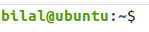

On the twelveth day, I learned the following things about Linux.

- The command line interface will communicate with the kernel and it will give the input to the kernel to do a certain task and as a result the kernel will perform that operation.
- In the command prompt, the path will be given to you that has two parts.

    **1.** The first is the user part and

    **2.** the second is the host part. In between them, there is a separater **"@"**

 
    

- `where filename` will show you the list of directories in which a file is present.
- `open .` will open all the files present in a specific directory.
- `echo $PATH` When one types a command to run, the system looks for it in the directories specified by PATH. It will display the files and folders paths by the difference of colon **:** It will check the executable command in one of these paths.
- `echo "Hey" > file.txt` will override the text in a file.
- `echo "Hey" >> file.txt` will append the text in a file.
- `export MY_PATH="Bilal"` will create another path that will contain the string. But this is not permanent

- `pwd` will show the present working directory in which you're currently present.
- `ls` will show you the list of all the files present in a specific directory.
- `ls -a` will show you the list of all the hidden files present in a specific directory. Hidden files are starting from dot **.**
- `ls -l` will show you the list of files with long details present in a specific directory.
- `ls -la` will show you the list of more files including hidden files  with long details present in a specific directory.
- `ls -R` will find all the folders and sub folders and so on recursively.
- Dot **.** means current directory, **..** double dot means previous directory. 
- `cd `(change directory) will change the path location from one directory to another.
- `cat filename `(concatenate) will print all the content of a file in a standard output.
- `cat > filename` will create a new file if it is not present and allow us to enter the text also.
- `tr` will translate the characters from one string to another string.
- `cat lower.txt | tr a-z A-Z > upper.txt`, the output of the first command is the input of the second command.
- `man command-name` will show you the details of a specific command.
- `mkdir directory-name` will create a new directory.
-  `mkdir -p random/middle/hello` will create a middle directory b/w two directories. `-p` is used for parent's command.
- `touch filename` will create a new file.
- `cp file.txt copy_file.txt` will make a copy of the file.txt
- `cp -R test random` will copy the test directory into the random directory.
- `mv file.txt random` will move the file.txt to the random folder.
- `mv file.txt new_file.txt` will rename the file.txt to new_file.txt.
- `mv test renamedTest` will rename the directory.
- `rm file.txt` will remove a file from your computer permanently.
- `rm -R directory-name` will remove the directory recursively.
- `rm -rf directory-name` will forcefully remove the directory.

## **Explaining it in a video**

Here you can get an explanation in a video. [12/60 Day of DevOps Challenge](https://www.youtube.com/watch?v=fC7GimfksZA&list=PLptbpfKzsc3BtEki4tHQm5Xmpj8w1_JlM&index=11)