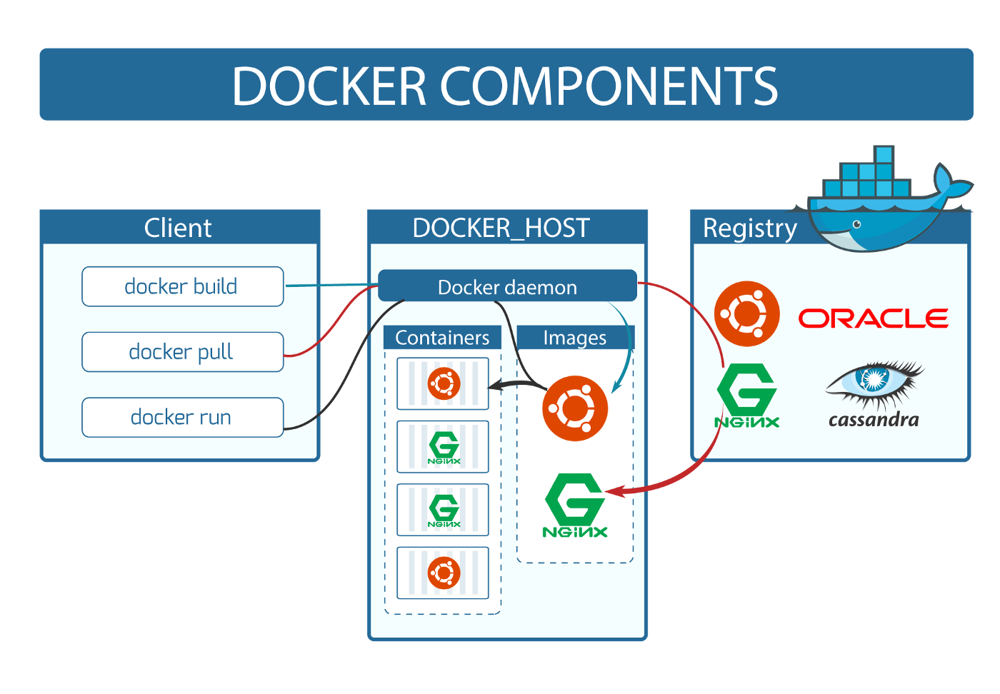

On the nineteenth day, I learned the following things about Docker and Containers.

 
    

## **DevOps**

In the **Dev** part, you
1. Create an application
2. Create and write a Dockerfile
3. Create an image
4. Create a container

In the **Ops** part, you
1. Download an image
2. Run that image
3. Operate on it

 
    

## **Commands**

- `docker run hello-world` will run the hello-world image.

It has three parts.
1. `docker` is a Docker CLI.
2. `run` will run an image to create a container.
3. `hello-world` is an image that is taken from the online cloud docker registry called docker hub.

When you first run the docker image, it will take sometime to download and run it. After downloading it, it will run fast.

- `docker run -it ubuntu` will run an ubuntu image. `it` is for interactive environment that will take you straight inside the container.

- `docker images` will show you all the images that are present on the local machine.

**Note:** When running an image, it also contains the operating system files and dependencies(like mini OS), so that an application works in an isolated environment without interacting with an operating system outside the container.

- `docker pull ubuntu` will only download an image without running it.
- `docker pull ubuntu:20.04` will download the specified version of an image.

- `ps aux` will show you the processes that are currently running.

- `docker ps` is a Docker command to list the running containers.
- `docker container ls` is a Docker command to list the running containers.

- `docker container exec -it container_id bash` execute an interactive bash shell on the container. It will allow multiple terminals to run on one container.

- `docker start container_id` will stop the container.

- `docker stop container_id` will stop the container.

- `docker ps -a` will show the list of stopped containers.

- `docker rm stopped_container_id` will remove the specified stopped container.

- `docker container prune -f` will the delete all the stopped containers. `f` means by force. Don't ask again.

- `docker inspect image_name/container_id` will give all the information about the container.

- `docker run alpine ping www.google.com` will ping the website. Alpine is relatively lower in size and it provides almost all the functionalities that an Ubuntu Image can.

If the containers are running for a long time and running in the background then servers are the best solution for it. You can use Alpine for it and once the Alpine is stopped, the container will be removed.

- `docker run -d alpine ping www.google.com` will run the container in the detached mode which means while running the command, there is no need to be present on the terminal.

- `docker run ubuntu echo Hey` will print "Hey" on the terminal.

- `docker logs full_container_id` will show the history of all the activities that you have done.

**FFI = first_few_characters_from_the_container_id**

- `docker logs FFI` will give you the history of that container.

- `docker logs --since 5s FFI` will show the first 5 seconds history of the container.

- `docker stop FFI` will stop the container.

- `docker rm FFI` will remove the stopped container.

- `docker rmi image_name -f` will remove an image.

- `docker run -d -p 8080:80 nginx` will give you access on your local port. `-d` is for detach, `-p` is for port. 

This will be used to access something in a computer that is present inside the container of a computer. Whatever traffic is on the port :80 or inside the nginx container, forward all the requests that you're making to the localhost 8080 inside the container's port :80. 

Whenever you'll go to the localhost 8080, it will forward it inside the container's :80. Here 8080 is the **host port**, this port you will be able to access in your machine, whereas port 80 is **container port**, this will not be accessible outside the container.

**Port forwarding** or port mapping redirects a communication request from one IP address and port number combination to another.

## **Explaining it in a video**

Here you can get an explanation in a video. [19/60 Day of DevOps Challenge](https://www.youtube.com/watch?v=iNJNyqc0628&list=PLptbpfKzsc3BtEki4tHQm5Xmpj8w1_JlM&index=18)