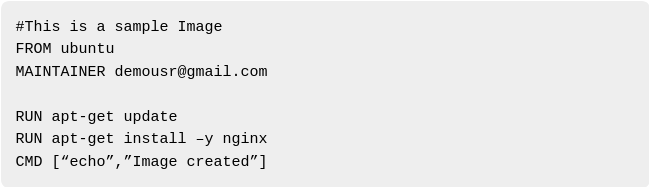

On the twenteeth day, I learned the following things about Docker and Containers.

- `docker commit -m "add a message here" container_id new_image_name` will commit and transfer a container’s file data or settings into a new image.

- `docker images -q` will give you the IDs of docker images.

- `docker images -q --no-trunc` will list the hash values of all the docker images.

- `docker rmi $(docker images -q) -f` will remove all the images at once. It won't delete the running container.

- Images are build in layers. Each layer is immutable(can't be changed or renamed), but image is a collection of files and directories.
Each image may contain common files that are present in other images also. So instead of installing common files with each image, it will skip those files and only download the uncommon files that are not present in other images. These common files will be used in all the images and it will make the process fast.

- You can create your own image by simple creating a Dockerfile. Inside the Dockerfile, write the following things.

 
    

The following points need to be noted about the above file −

- The first line "#This is a sample Image" is a comment. You can add comments to the Docker File with the help of the # command.

- The next line has to start with the FROM keyword. It tells docker, from which base image you want to base your image from. In our example, we are creating an image from the ubuntu image.

- The next command is the person who is going to maintain this image. Here you specify the MAINTAINER keyword and just mention the email ID.

- The RUN command is used to run instructions against the image. In our case, we first update our Ubuntu system and then install the nginx server on our ubuntu image.

- The last command is used to display a message to the user.

- `.dockerignore` will ignore the files that are not required when creating an image.

- `docker build -t myimage:1.01 .` will create your own docker image.

## **Docker Engine**

        |-----------------------------------------------------------------------------------------------------|
        |   -----------------    ----------    --------------     | => Shim    | => runc    | => container    |
        |   | Docker Client | >> | Daemon | >> | Containerd | >>  | => Shim >> | => runc >> | => container    |
        |   -----------------    ----------    --------------     | => Shim    | => runc    | => container    |
        |-----------------------------------------------------------------------------------------------------|

- Docker Daemon talks to Containerd via grpc procotol.
- If the Daemon is stopped, all the running containers will be stopped. Shim will avoid this situation and containers will be running even if the daemon is stopped.
- If the functionalities are performed by containerd then why the daemon is present? Daemon also performs some functionalities like managing images, networking etc.
- Daemon has a binary file **dockerd**
- Containerd has a binary file **docker-containerd**
- Shim has a binary file **docker-containerd-shim**
- runc  has a binary file **docker-runc**

## **Explaining it in a video**

Here you can get an explanation in a video. [20/60 Day of DevOps Challenge](https://www.youtube.com/watch?v=ZRblUgxVjU8&list=PLptbpfKzsc3BtEki4tHQm5Xmpj8w1_JlM&index=19)