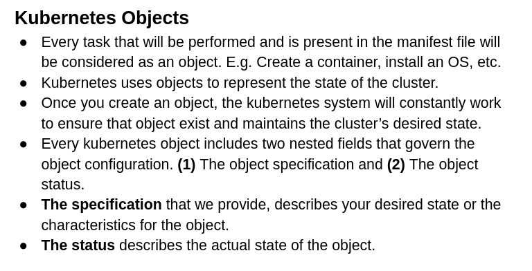
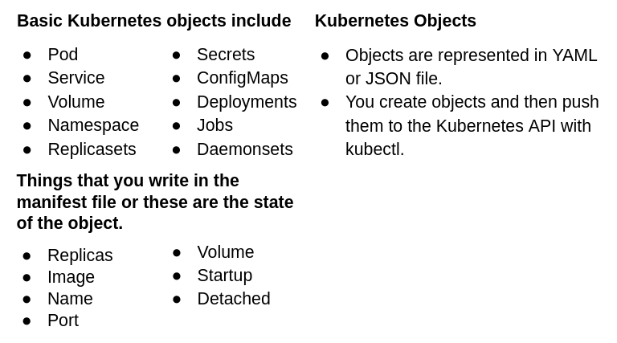

On the twenty-third day, I learned the following things about Kubernetes.

 
    

 
    

- First update the machine by writing `sudo apt-get update`.

- Once the instance is created, write `sudo su` to go to the root user.

- First of all install the docker by writing `sudo apt update && apt -y install docker.io`

- Then install the kubectl by writing `curl -LO https://storage.googleapis.com/kubernetes-release/release/$(curl -s https://storage.googleapis.com/kubernetes-release/release/stable.txt)/bin/linux/amd64/kubectl && chmod +x ./kubectl && sudo mv ./kubectl /usr/local/bin/kubectl`

- Then install the minikube by writing `curl -Lo minikube https://storage.googleapis.com/minikube/releases/latest/minikube-linux-amd64 && chmod +x minikube && sudo mv minikube /usr/local/bin`

- Once the minikube is installed, start it by first writing `apt install conntrack`

- After that, type `minikube start --vm-driver=docker` and it will give you the following error.

 
    

- It is saying that docker should not be used with root privilege. To solve this problem, press `CTRL+D` to go out from root.

- After that, again type `minikube start --vm-driver=docker` and it will give you another following error.

 
    

- To solve this problem, type the following commands.

      sudo groupadd docker
      sudo usermod -aG docker $USER
      newgrp docker

- If it is still not working then visit this [website](https://linuxhandbook.com/docker-permission-denied/#:~:text=deal%20with%20it.-,Fix%201%3A%20Run%20all%20the%20docker%20commands%20with%20sudo,the%20Docker%20daemon%20socket%27%20anymore.) that will show you more ways.

- Visit this link [StackOverflow](https://stackoverflow.com/questions/65397050/minikube-does-not-start-on-ubuntu-20-04-lts-exiting-due-to-guest-provision) and it will show you the solution if you faced a problem.

- Once the commands are executed successfully, you will get the following result.

 
    

- If you type `minikube status`, it will show you running status.

**Note:** The above screenshots are executed by using the AWS instance but if you run these commands in your local machine then they will be successfully executed because I installed minikube on my local machine also using these commands.

- You can get more info about **kubectl** installation by visiting this [page](https://kubernetes.io/docs/tasks/tools/).

- You can get more info about **minikube** installation by visiting this [page](https://minikube.sigs.k8s.io/docs/start/).

- `minikube version` will show the version of minikube.

- `minikube dashboard` will show you the minikube dashboard in your browser.

- `minikube docker-env` will give some environment variables that will help you to communicate with remote servers.

- `minikube ssh` will take you inside the minikube.

- `docker container ls` will show you the list of containers that are required for Kubernetes.

- `docker ps` will show you the list of containers that are required for Kubernetes.

- `kubectl get pods` will show you the pods that are running.

- `kubectl get nodes` will show you the nodes that are running.

- `kubectl describe node node-name` will show you the information about a particular node.

**Data in YAML file**

    kind: Pod
    apiVersion: v1
    metadata:
      name: testpod
    spec:
      containers:
        - name: c00
          image: ubuntu
          command: ["/bin/bash", "-c", "while true; do echo Hello-Bilal; sleep 5; done"]

- `kubectl apply -f pod.yml` will run the comands that are present in the yaml file.

- `kubectl get pods -o wide` will show you the exact location of the pods with their ip addresses.

- `kubectl describe pod pod-name` OR `kubectl describe pod/pod-name` will show each and every detail of a pod.

- `kubectl logs -f pod-name` will show you the information of the container(s) in a specific pod.

- `kubectl logs -f pod-name -c container-name` will show you the information of a specific container in a specific pod.

- `kubectl exec pod-name -it -c container-name -- hostname -i` will show you the ip the address of the pod that contain these containers.

- `kubectl delete pod pod-name` OR `kubectl delete -f pod.yaml` will delete a specific pod. A pod can either be deleted by pod-name or a filename that contains the pod information.

- Now write annotations for the description of a pod.

      kind: Pod
      apiVersion: v1
      metadata:
        name: testpod
        annotations:
          description: Our first test pod is created.
      spec:
      ...

- `kubectl describe pod pod-name` OR `kubectl describe pod/pod-name` will show each and every detail of a pod.

**Data in YAML file for multiple containers**

    kind: Pod
    apiVersion: v1
    metadata:
      name: testpod2
    spec:
      containers:
      - name: c00
        image: ubuntu
        command: ["/bin/bash", "-c", "while true; do echo Hello-Bilal; sleep 5; done"]
      - name: c01
        image: ubuntu
        command: ["/bin/bash", "-c", "while true; do echo Hello-Khan; sleep 5; done"]

- First apply the file by writing `kubectl apply -f pod.yml`

- `kubectl exec pod-name -it -c container-name -- /bin/bash` will move you inside the container.

- `ps -ef` will show you the things that are running inside the container.

- `kubectl logs -f pod-name` will show you the information of the container(s) in a specific pod.

- `kubectl logs -f pod-name -c container-name` will show you the information of a specific container in a specific pod.

**Writing environment variables in YAML file**

    kind: Pod
    apiVersion: v1
    metadata:
        name: environment
    spec:
      containers:
        - name: c00
          image: ubuntu
          command: ["/bin/bash", "-c", "while true; do echo Environment-variables; sleep 5; done"]
          env:
            - name: MYNAME
              value: Bilal

- First apply the file by writing `kubectl apply -f pod.yml`

- After going inside the container by this command `kubectl exec pod-name -it -c container-name -- /bin/bash`, type `env` to get the environment variables.

- After getting inside the container, type `echo $MYNAME` to get the environment variable value.

- `kubectl config view` will show you the information about the cluster.

- `kubectl config current-context` will display the current context.

- `kubectl get all` will show you the pods, services, deployment, replicaset etc.

- `minikube stop` will stop the minikube.

## **Explaining it in a video**

Here you can get an explanation in a video. [23/60 Day of DevOps Challenge](https://www.youtube.com/watch?v=MWXARs8Xwx8&list=PLptbpfKzsc3BtEki4tHQm5Xmpj8w1_JlM&index=59)