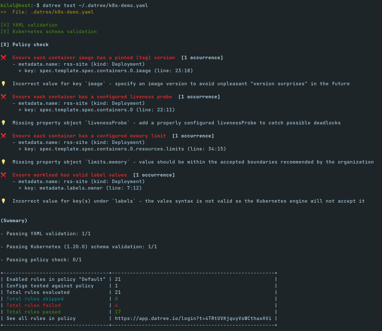
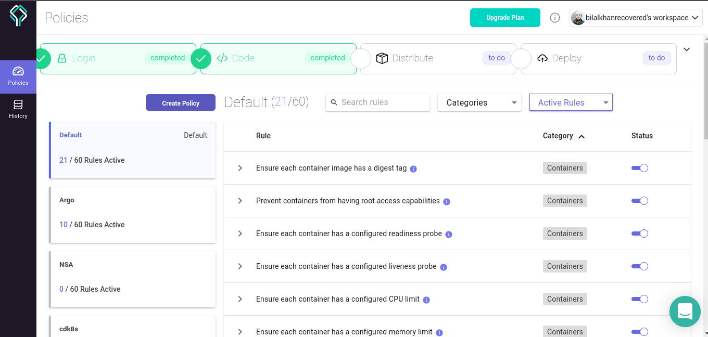
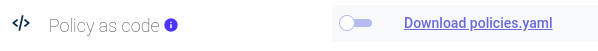

On the twenty-eighth day, I learned the following things about Datree.

# Datree

- Datree will help developers to prevent misconfigurations in files before going to the production. 

- Before causing failures, datree will check the file and after checking out, it will forward it.

- It will first perform validation before going to production.

## Get started

- Visit https://www.datree.io/ to get started with datree.

- Click on the Quick start button, it will lead you to the https://hub.datree.io/.

- Signup to the account. You can signup with GitHub or Google.

- After signup, open https://hub.datree.io/ again and install the Datree CLI.

- The installation commands varies according to the operating system but for Linux write this command in the terminal `curl https://get.datree.io | /bin/bash`.

- You will get the following output in your CLI:

 
    

- After installing datree, type ` cat ~/.datree/k8s-demo.yaml`. It will show you demo kubernetes file.

- `datree test ~/.datree/k8s-demo.yaml` will show you the validation.

## How to handle multiple rules?

- In kubernetes, there are so many rules in kubernetes like for containers, deployment, cron jobs, networking etc.

- Datree provides built-in rules that will be checked in the file. Now the question arises that how to avail those rules.

**Below are the steps:**

- After the account creation, there will be a blank page and it will ask you to click on the Setup button.

- After clicking on the setup button, you will see a pop up window showing you three commands to run. First is to install the datree as I have done it previously. The second command is the below that I am going to run and the third command is to run the CLI.

- To check it, write the second command `datree test ~/.datree/k8s-demo.yaml`. It will give you the result as it is present in the above picture.

- There are some checks that is run by the test command. If you take a look at them, you will see that YAML is validated, and kubernetes schema is also validated but the 4 policies checks are failing.

- If you close the popup as I have told you earler and refresh the datree page, you will see the image in the history of datree page.

- The first error is `❌  Ensure each container image has a pinned (tag) version  [1 occurrence]`. It means that the nginx inside the `~/.datree/k8s-demo.yaml` file does not have a specific version. Instead only the latest version is mentioned.

- The second error is `❌  Ensure each container has a configured memory limit  [1 occurrence]`. It means that in the demo file, the memory limit is not provided.

- The third error is `❌  Ensure each container has a configured liveness probe  [1 occurrence]`. It means that livenessProbe is not present. Although the readinessProbe is present but it is desiring livenessProbe.

- The fourth error `❌  Ensure workload has valid label values  [1 occurrence]`. It means that owner does not have a value.

## Publish the rules and share them

- Go to the policies page and find the `pinned (tag)`. You will see the pinned tag option. Now close this option and this time, if you run the `datree test ~/.datree/k8s-demo.yaml`. It will show you 3 failures instead of four.

- You can enable the rule by enabling the checkbox there and it will be appeared again. This is the first method.

 
    

- The second method is that if you want to enable that rule and show it again, go to the settings and enable the policy as code check box and then download the policies.yaml.

 
    

- In the *policies.yaml* file, uncomment any of the rule and then pulish it by writing, `datree publish policies.yaml`.

You can share your policy with others also. After downloading the file, give it to others and comment and uncomment the data that you want to show them.

## Make changes in YAML file

- First edit the file by writing `sudo vi ~/.datree/k8s-demo.yaml` and then add a curly braces or made other changes.

- After writing `datree test ~/.datree/k8s-demo.yaml`, you will see that a new error is generated.

## Create your own policy

- Creating your own policy is useful for different stages of deployment like for testing environment you want particular kind of policy check etc.

- Click on the Create policy and give it a name.

- Initially it will contain no rules and you can give rules by enabling it.

- After enabling the rules, type `datree test ~/.datree/k8s-demo.yaml -p <policy-name>`. It will give you all the errors that has occurred.

## What is token?

- Token will build a connection b/w CLI and the GUI of datree. Whenever something happens in the CLI, it will be updated in the Datree dashboard.

- To access the token, click on the settings and open the token management. You will see a hidden token and you can copy it.

- You can also access it using CLI by writing, `cat ~/.datree/config.yaml` and it will show you the token.

- You can change the token by typing `datree config set token <TOKEN>` and it will be set.

## **Explaining it in a video**

Here you can get an explanation in a video. [28/60 Day of DevOps Challenge](https://www.youtube.com/watch?v=L_pwnsJA7zI&list=PLptbpfKzsc3BtEki4tHQm5Xmpj8w1_JlM&index=26)