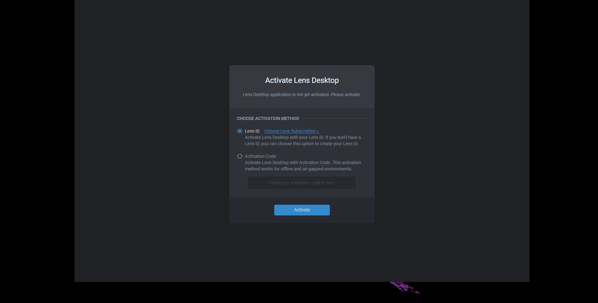
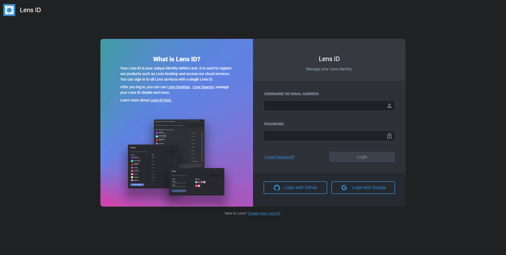
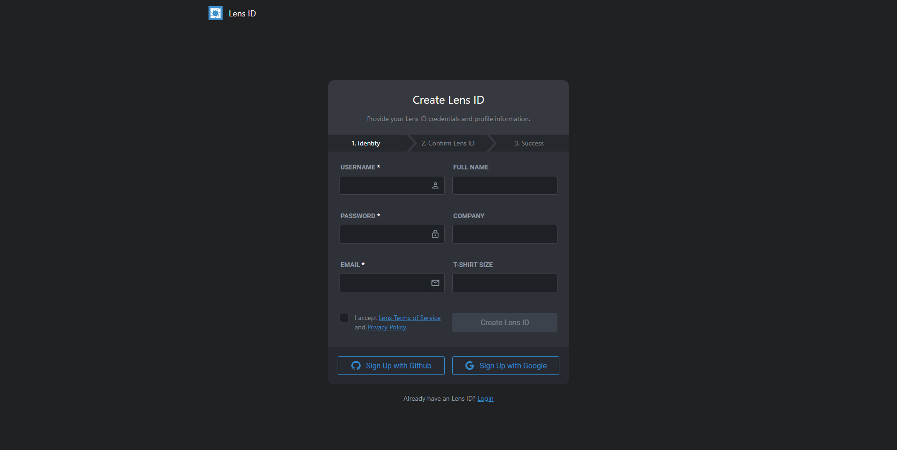
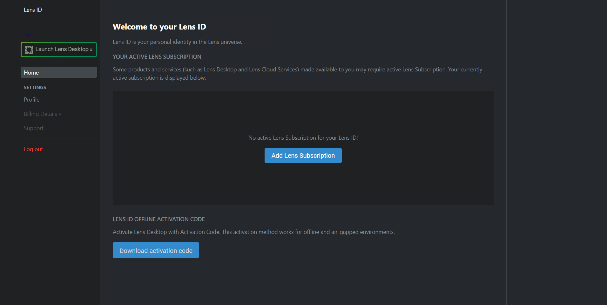
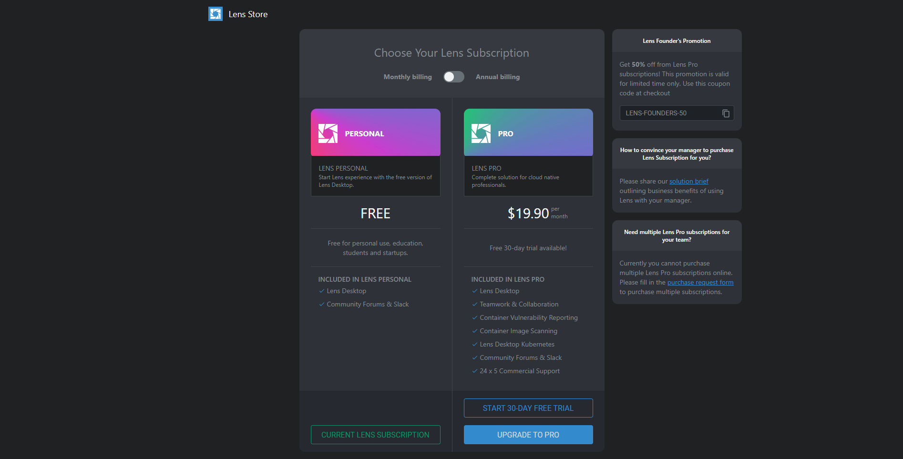
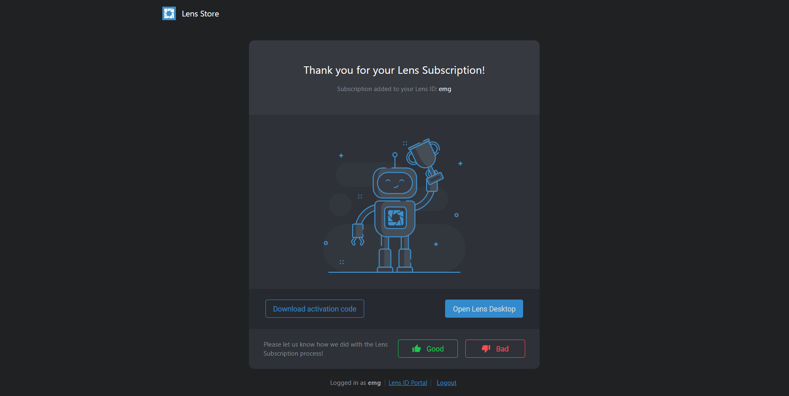
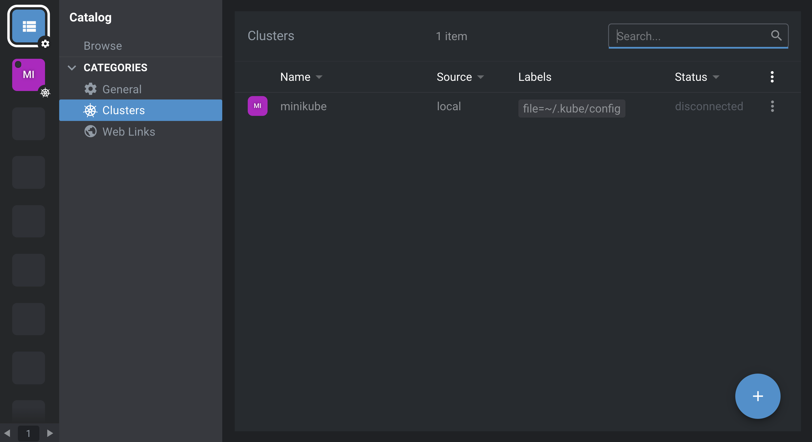

On the twenty-ninth day, I learned the following things about Lens.

# Lens

- Lens is an open source application that will help you in managing and monitoring clusters in real time.

- It is a powerful IDE for people to deal with clusters on their daily basis. Otherwise you will have to use command line tools and big YAML files.

- With lens, you can see the setup, configuration and increase the visibility that what is going on inside the cluster. You can get the statistics and add your dashboard.

## Installation

- You can download it from the Lens [website](https://k8slens.dev/). The site will suggest the appropriate download for your system—Mac, Windows, or Linux.

-  When you first open the application, it will prompt for your Len ID.

 
    

- Choose Lens ID if you already have a Lens ID or need to create one. Alternatively, you can select Activation Code to proceed with an air-gapped installation, if you have already set up an activation code.

**Note:** If you wish to perform an air-gapped installation but don’t have an activation code yet, you will need to create a Lens ID on an internet-connected device—you can do that on the Lens ID site, following the instructions below for new account creation.

- On the next page, either log in or select Create your Lens ID.

 
    

- You will need to enter a username, password, and email. Alternatively, you can authenticate with a GitHub or Google account.

 
    

- You will need to verify your email, then select Add Lens Subscription.

Note: From this Lens ID management page, you will also be able to create an activation code for air-gapped installation.

 
    

- Choose a Lens Personal or Lens Pro subscription. (A 30-day free trial of Lens Pro is available).

 
    

- Now you're ready to get started with Lens!

 
    

- Select Open Lens Desktop to open Lens. The application will check for updates, and then you’ll be ready to get started.

## Connecting to a cluster

Lens will search common directories for kubeconfig files. If you click Browse clusters in catalog on the welcome page (or select the catalog icon in the upper right-hand corner), you may already find some clusters listed—local development clusters, for example. You can simply click on these clusters to connect to them with Lens.

 
    

- If the minikube cluster is not present, then it is the problem of configuration file.

- Open the *~/.kube* directory and inside it, open the *config* file. If the data inside the config file is like the below data then it means that the minikube won't appear.

      apiVersion: v1
      clusters: null
      contexts: null
      current-context: ""
      kind: Config
      preferences: {}
      users: null

- The solution for this is to copy the data of the *admin.conf* file and paste it into the conf file. *admin.conf* file will be present in the $HOME directory.

## Create a resource

- Click on the plus button to open a terminal and click to create a resource.

- After the terminal is opened, just select the type of resource that you want.

## **Explaining it in a video**

Here you can get an explanation in a video. [29/60 Day of DevOps Challenge](https://www.youtube.com/watch?v=1Zf0tEYBylc&list=PLptbpfKzsc3BtEki4tHQm5Xmpj8w1_JlM&index=27)