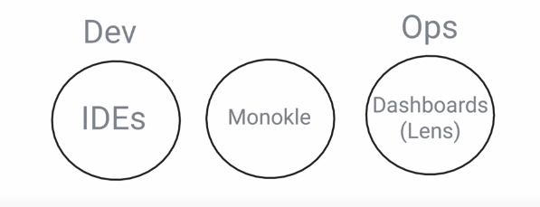
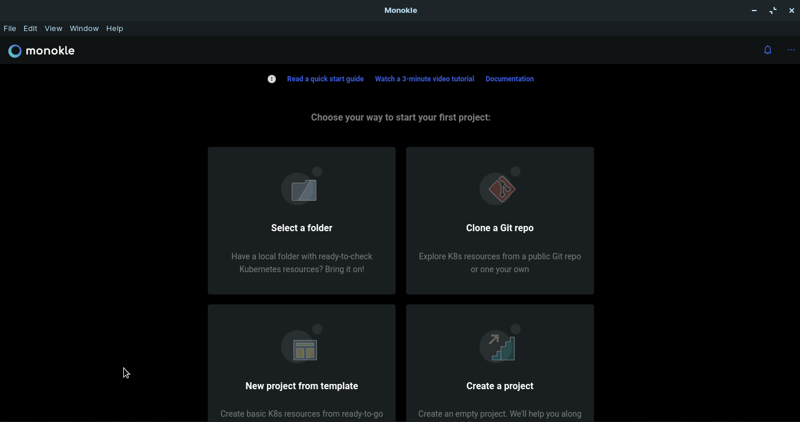
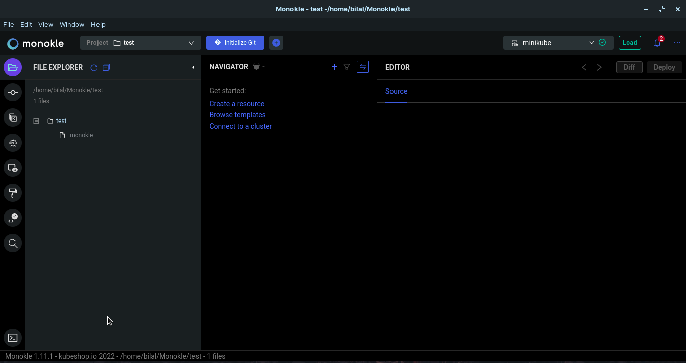

On the thirtith day, I learned the following things about Monokle.

# Monokle

- Monokle will manage and debug your manifests before you deploy them to your cluster.

- It will help you identify multiple kubernetes objects connection and their place in the manifests.

- It is a great tool to inspect your Kubernetes manifests with an easy interface showing you how your manifests are connected to each other and how they translate to your existing cluster. It also allows your team to avoid drifts between your manifests and clusters as you keep adding more and more components.

## Where monokle lies?

- Monokle lies in b/w Dev and Ops. Let's take a look at this picture.

 
    

- After development, the manifest will be given to the monokle for debugging and then it will be deployed.

## Installation

- Go to this [website](https://github.com/kubeshop/monokle) and download the monokle according to your operating system.

- After installation, open the monokle. It will show you this screen.

 
    

- Click on open a new/empty project and give it a name.

## Work with YAML file

- After insallation, open the documentation [website](https://kubeshop.github.io/monokle/) and click on working with Kustomize and it will lead you [here](https://github.com/argoproj/argo-rollouts/tree/master/manifests).

- Click on the [argo-rollouts](https://github.com/argoproj/argo-rollouts) and copy the HTTPS link so that you can clone it.

- Open the terminal and type `git clone https://github.com/argoproj/argo-rollouts.git` to clone the repository.

- Open the documentation again and now click on working with Helm and it will lead you [here](https://github.com/emissary-ingress/emissary/tree/master/charts/emissary-ingress).

- Click on the [emissary](https://github.com/emissary-ingress/emissary) and copy the HTTPS link so that you can clone it.

- Open the terminal and type `git clone https://github.com/emissary-ingress/emissary.git` to clone the repository.

## Initial page

 
    

## **Explaining it in a video**

Here you can get an explanation in a video. [30/60 Day of DevOps Challenge](https://www.youtube.com/watch?v=jdTXItTCPGs&list=PLptbpfKzsc3BtEki4tHQm5Xmpj8w1_JlM&index=28)