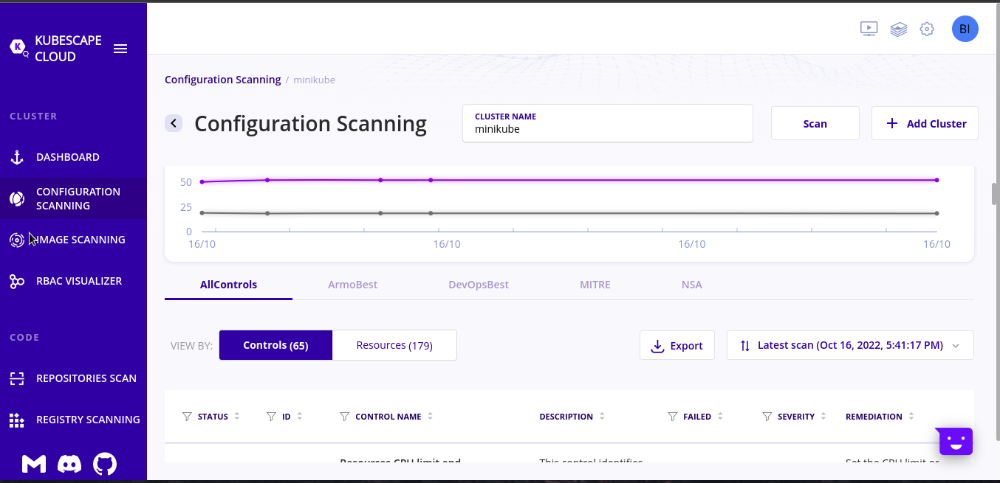
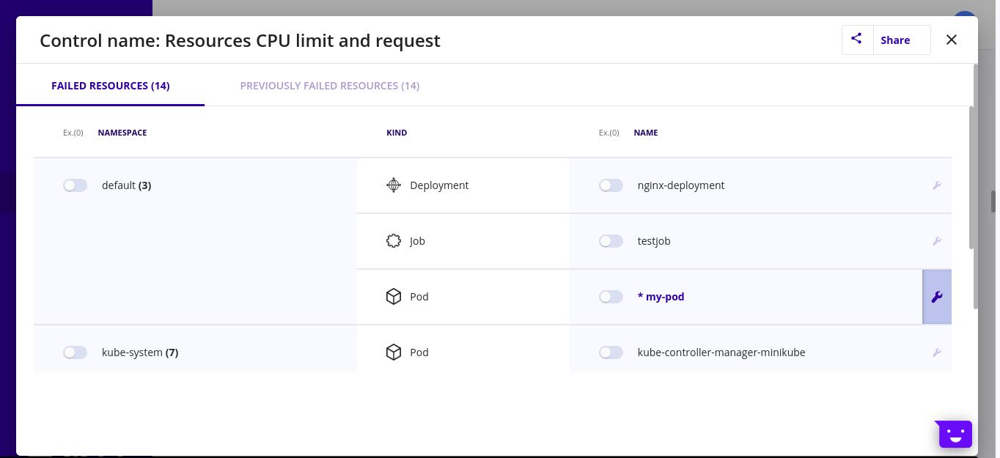

On the thirty first day, I learned the following things about Kubescape.

# Kubescape

- Kubescape scans K8s clusters, Kubernetes manifest files (YAML files, and HELM charts), code repositories, container registries and images, detecting misconfigurations according to multiple frameworks (such as the  NSA-CISA,  MITRE ATT&CK®), finding software vulnerabilities, and showing RBAC (role-based-access-control) violations at early stages of the CI/CD pipeline. It calculates risk scores instantly and shows risk trends over time.

- You can create your own frameworks to secure the clusters.

- It provides both the CLI and the GUI format to make the usibility easy.

- Read the detailed article about Kubescpe [here](https://www.armosec.io/blog/kubescape-the-first-tool-for-running-nsa-and-cisa-kubernetes-hardening-tests/).

## Installation

- Go to this GitHub [repo](https://github.com/kubescape/kubescape) and install the kubescape according to your operating system.

## Create YAML files

- Open the monokle application and click on new project from template.

- Give a project name and click on the create button.

- Click on the advanced pod template button, click on the start, give it a name, namespace, image, click on the submit and done.

- Once it is created, save and deploy it.

- Open the Lens application, go to your catalog, click on the clusters and open the minikube node.

- Once it is opened, click on the plus button on the side with terminal and click on the create resource.

- Select a Deployment template and click on the create and close button on the upper right side of the terminal.

- After creating the deployment, if you write, `kubectl get pods`, it will show you the pods running under the deployment.

- If you type `kubectl get deployment`, it will show you the deployment also.

## Performing scan

- Once the kubescape is installed, pod and deployment are created, the next step is to type `kubescape scan --submit --enable-host-scan --verbose` to perform scanning.

- Once the scanning is done, you will a lot of data in terminal showing you where the scanning is failed and passed.

- It will also show you the severity of the data, whether it is high severity, medium or low.

- At the end, it will show you the resource summary by pointing you the risk score and the number of resources.

## Opening the GUI

- At the end, it will give you a link and that link will lead you to the armosec.

- After opening the link, the kubescape cloud page will be like this:

 
    

- if you scroll down, there will be a bunch of failed statuses, their IDs, descriptions.

- If you click on any of the failed status, it will give you a pop page like this one.

 
    

- As you can see that these are the pods, deployments and other things that are present in my minikube.

- You can also open and close the boxes if you want. It means that they will be ignored.

- The wrench that you see attached with each object will take you to the file and show you the lines in which the errors are present.

## Making your own framework

- You make framework because you want your own rules to be present in the project. They are the custom rules like deployment, testing etc.

- Click on the settings on the above right side of the kubescape.

- On the side menu, under the posture heading, click on the frameworks and it will open a page for you.

- Click on create a new framework. Give framework a name and a description and check some errors.

- Open this [website](https://cloud.armosec.io/repositories-scan) and click on the repositories scan option.

- Take a copy of the second option that is **Scan a cloned repository from a local directory**. The will be the copy `kubescape scan framework <framework-name> --submit --account <string-and-numbers>`.

- After running the above code, you will see the details of errors of your newly created framework.

## Scan a YAML file

- Go to the directory in which the YAML file is present and open the terminal there.

- Write `kubescape scan filename.yaml` to scan one YAML file or if you want to scan all the files, write `kubescape scan *.yaml`.

- Write `kubescape scan <github-repository-link> --submit` to scan the whole repository.

## **Explaining it in a video**

Here you can get an explanation in a video. [31/60 Day of DevOps Challenge](https://www.youtube.com/watch?v=nnt3V8YifEA&list=PLptbpfKzsc3BtEki4tHQm5Xmpj8w1_JlM&index=29)