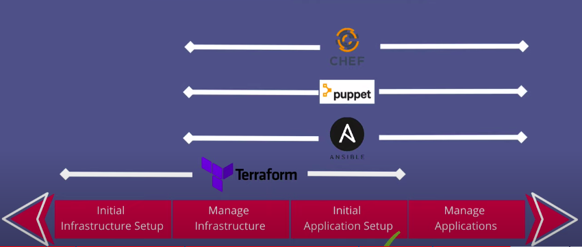

On the thirty fifth day, I learned the following things about Terraform.

## DevOps tasks before automation

- In the past, when you had tasks before automation and you wrote an application and wanted to deploy it on the server, for that you have to do many things like:

    - Get the servers and set them up
    - Configure networking on those servers.
    - Create route tables.
    - Install necessary softwares.
    - Configure the software.
    - Install database etc.

- All these things were manually done by system administrators and as a result, there were more human resources cost and more time and effort.

- The above points were just the setup phase. After that, you had to maintain them like update the versions, deploy new release of an application, DB backups and updates, recover app and servers after crash and add the new servers also, etc.

## DevOps tasks after automation

- After the tasks were automated using DevOps, you can now automate all the process with infrastructure-as-code.

- Infrastructure as code automate all the tasks instead of doing them manually.

- All the knowledge and expertise of system administrators and operations team are packed into various programs and applications that carry out all these tasks.

- IaC is a concept but there are IaC tools and programs(Terraform, Ansible, Chef, etc) that carry out these tasks.

### Why are there so many tools? Can't we have just one tool?

- Currently there is no tool that is doing all the tasks. Instead different tools are doing different tasks and each of them is good in that specific area.

## Main categories.

- There are 3 main categories of such tasks

1. Provisioning of infrastructure

    - Spinning(Twisting) up new servers
    - Doing network configuration
    - Creating load balancers
    - Configuring all the stuff on the infrastructure level

2. Configuring already provisioned infrastructure

    - Installing applications on the servers
    - Managing those applications
    - This step is required to prepare the infrastructure or servers with all the necessary stuff to deploy your application.

3. Deployment of application on the configured infrastructure

    - With docker, the configuration and deployment are merged together.
    - You package the configured application in a container and deployment them on a server.

- Infrastructure as code automate the tasks in different categories for different phases.

- You will use the combination of 2 or more IaC tools to automate the whole process.

 
    

- Terraform is used for provision and configure the infrastructure and it is made specifically for the infrastructure.

- Ansible and other tools are used to install and deploy applications on that provision infrastructure and they are made specifically for the configuration.

# Terraform

- Terraform is an open-source Infrastructure-as-code(IaC) tool developed by HashiCorp and it helps companies with infrastructure-as-code and automation.

- It is used to define and provision the complete infrastructure using an easy-to-learn language HCL(HashiCorp configuration Language).

- You can write your infrastructure as code on any cloud platform. It means that you're not dependent on a specific cloud provider like AWS, Azure, GCP, etc. Terraform will work for all.

## Installation

- Visit this [website](https://developer.hashicorp.com/terraform/downloads) and download and install terraform according to your operating system.

- Once the terraform is installed, check its version by typing `terraform --version`.

## Hello World Terraform Configuration

- Create a directory by the name of **terraform** and inside that directory, create a subdirectory by the name of **hello-world**.

- Inside the **hello-world** directory, create a *first.tf* file by typing `vi first.tf`.

- Write the following data inside the file.

      output hello {
          value = "Hello World! Enjoy"
      }

- After writing and saving the data, type `terraform plan` and it will show the key and values that you have printed and it will show you the result.

## **Explaining it in a video**

Here you can get an explanation in a video. [35/60 Day of DevOps Challenge](https://www.youtube.com/watch?v=mAHoxXwz-WA&list=PLptbpfKzsc3BtEki4tHQm5Xmpj8w1_JlM&index=33)