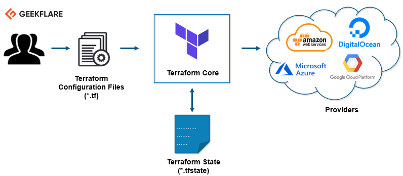
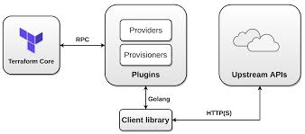

On the thirty ninth day, I learned the following things about Terraform.

# Terraform Core and Terraform Plugin

- In this video, we're going to create some resources on the GitHub repo.

- Visit a [website](https://registry.terraform.io/). It will show you all the providers in which you can create your terraform infrastructures.

## How terraform will work in the infra?

- You can create resources on GitHub, AWS, Azure, etc but how does terraform create the resources? What is the process?

 
    

- First a developer will write configuration files, then it will ask terraform to create resources for them. Terraform will create the resources on AWS, Digital Ocean and other cloud providers.

- When the terraform will create the resources, it will maintain the state of them in **.tfstate* file.

- A question arises that how terraform will create the resources? The answer for this is the **plugin**. The resources will be created with the help of plugins.

 
    

 

- When you will mention the cloud provider in the terraform. The terraform will download the plugin of that cloud provider.

- The terraform will tell the plugin that it wants a particular resource on a particular cloud provider.

- Every cloud provider plugin is different from other cloud provider plugin.

- If you're working in an organization and that organization has an in-house cloud provider. In this case, if a particular plugin is not present in that cloud provider then you can create your own plugin using Golang and then the terraform will create resources based on your own create plugin.

## Create your first Terraform Resource in the GitHub repository

- Create a directory by the name of **terraform-first-resource** and get inside it by writing `cd terraform-first-resource`. Create a file in the directory by the name of *terraform.tf*.

- Go to [terraform registry](https://registry.terraform.io/) and search the cloud provider. I will use the github provider which you can find [here](https://registry.terraform.io/providers/integrations/github/5.7.0).

- You have to mention the cloud provider in your terraform file so that it fetch the resources.

- Open the *terraform.tf* and write the following data into it.

      provider "github" {
        
      }

- Now we want to add the resources in the github provide. To do this, go to the [documentation](https://registry.terraform.io/providers/integrations/github/latest/docs) of github provider and click on the resources on the left side and find the *github_repository*.

- Click on the *github_repository* and copy the example usage code, paste it in the *terraform.tf* file and make some changes in it.

      resource "github_repository" "terraform-first-repo" {
        name        = "first-repo-from-terraform"
        description = "My first resource from terraform"
        visibility  = "public"
        auto_init = true
      }

- In this block of code, first there is a *github_repository* that will show that it will create a github repository.

- *terraform-first-repo* is a name through which terraform will identify it in the local machine.

- *name* is the repository name that will be created.

- *description* is the description of the repository.

- *visibility* is public for repository.

- *auto_init* will create a README file.

- `terraform plan` will show you the plan, read the terraform configuration in the current working directory and tell you what the configuration will do.

- `terraform providers` will show you the providers that terraform is currently using.

- If you type `ls -a`, it will give you only the *terraform.tf* file.

- You don't need to download and install the provider plugins manually. You can simply write `terraform init` to initialize it.

- If you type `ls -a` again, it will give you one more file and one directory that are downloaded.

- Type `ls` to further get the subdirectories, you will get the providers that are used in the terraform configuration, the plugin version, an operating system that is used and the programming language in which the plugin is created etc.

- Now let's type `terraform plan`. Now it will show us all the things that will be added if they're applied.

- If you type `terraform apply`, and enter the value *yes*, it will give us an authentication error because we didn't define the github account in the provider to create the repository in.

- For that purpose, open your GitHub account, click on your avatar and click on the settings. Go to developer settings by scrolling down. Go to personal access tokens and Tokens (classic).

- Click on generate a new token, give the token a name and check all the boxes. Click on the generate token option.

- You will be provided a token that you just need to copy it and then write it in the provider like this:

      provider "github" {
        token="<token>"
      }

- Save the file, go to the terminal and write `terraform apply` command again to make the repository in github.

## **Explaining it in a video**

Here you can get an explanation in a video. [39/60 Day of DevOps Challenge](https://www.youtube.com/watch?v=I2jYKRZ4suU&list=PLptbpfKzsc3BtEki4tHQm5Xmpj8w1_JlM&index=37)