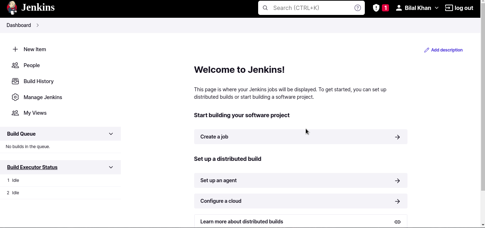
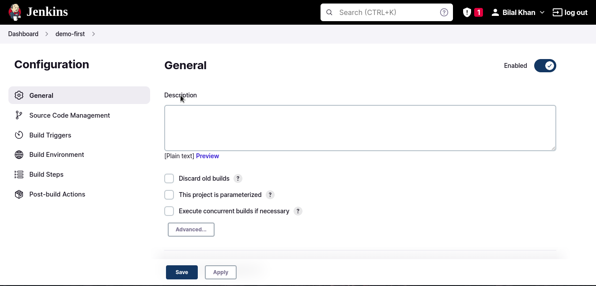

On the forty eigth day, I learned the following things about CI/CD Pipeline.

## Installation of Jenkins

- Visit this [website](https://www.jenkins.io/doc/book/installing/linux/) and first install the JAVA before installing the Jenkins otherwise jenkins won't start.

- I am using Ubuntu so I will run the following commands to install JAVA and Jenkins.

**Install JAVA**

    sudo apt update

    sudo apt install openjdk-11-jre

    java --version

**Install Jenkins**

    curl -fsSL https://pkg.jenkins.io/debian-stable/jenkins.io.key | sudo tee \
      /usr/share/keyrings/jenkins-keyring.asc > /dev/null

    echo deb [signed-by=/usr/share/keyrings/jenkins-keyring.asc] \
      https://pkg.jenkins.io/debian-stable binary/ | sudo tee \
      /etc/apt/sources.list.d/jenkins.list > /dev/null
        
    sudo apt-get update

    sudo apt-get install jenkins

    sudo systemctl enable jenkins

    service jenkins status

    service jenkins stop

## Access the Jenkins

- Find your machine ip address by writing `ifconfig`.

- Copy it and write `sudo -i`. It will open the root user for you.

- Include the PATH in the environment varaible otherwise it will give you this error: `'/usr/bin:/bin' is not included in the PATH environment variable.` The command for including is:

      export PATH="/usr/bin:$PATH"

- Add the ip address into the `etc/hosts` file by writing `echo "<ip-address> jenkins.local" >> /etc/hosts`.

- If you type `ping jenkins.local`, it will be pinged to the given address. If you want to access it through the browser then it will be accessed through `jenkins.local`.

- Enable the jenkins and start the service. Open the browser and type `http://jenkins.local:8080/` and it will open the window for you.

- In the window, you have to enter the administrator password. Go to the terminal and write `sudo cat /var/lib/jenkins/secrets/initialAdminPassword`. It will give you the password that it has already created during the jenkins installation.

- Paste the password and then you can install the plugins of your own choice or the suggested plugins. I will click on the suggested plugins.

- Wait for it and it will install the plugins for you. Once the plugins are installed, click on the continue button and create the first admin user, click on the continue. It will give you the jenkins URL. Click on Save and finish button. You will get a message to start the Jenkins.

## Dashboard Overview

- After opening the dashboard, it will look like this.

 
    

- Click on the New Item to create a new job.

- Click on the People to get a user.

- Click on the manage jenkins to set the system configuration, troubleshooting, etc.

- Click on the Full name and click on the configure option to set up the user details.

## Create your first job

- Click on the new item to create your first job.

- It will open a new window to create a new job and give it a name.

- After that click on the Freestyle project and press OK. These things came from the plugin.

- Now the configuration settings will be open for you for a new job.

 
    

**Print Hello World**

- Scroll down and click on Add Build Steps. It will show you the multiple options.

- Click on the Execute shell option and type `echo "Hello World"`.

- Scroll down and click on the Apply and save button.

- After applying, click on the upper-left option that is Dashboard. This dashboard will show you all the list of jobs.

- To run the job, click on the job and it will show you the down arrow to build it now.

- Once the job is build, open the job and it will show you the job on the lower-left corner.

- To check the output, click on the job that is build and click on the console output option.

**Find the user and the path**

- Click on the configure option of the job to add more options in the build like `whoami` and `pwd`.

- Click on the build it now option, open the job again and click on the console output option. It will show you the result.

- The user is jenkins which you can find in the terminal by typing `cat etc/passwd`. This user is created when the jenkins was installed.

- The path of the job is `/var/lib/jenkins/workspace/demo-first`. If you type `ls /var/lib/jenkins/workspace/`, it will show you the **demo-first** directory.

**Create a file**

- Click on the configure option of the job to create a new file in the build by writing `touch sample.txt`.

- Click on the build it now option, open the job again and click on the console output option. It will show you the newly created file.

- You can check the file by going inside **demo-first** directory by typing `ls /var/lib/jenkins/workspace/demo-first`.

## **Explaining it in a video**

Here you can get an explanation in a video. [48/60 Day of DevOps Challenge](https://www.youtube.com/watch?v=T0JA2g1eivo&list=PLptbpfKzsc3BtEki4tHQm5Xmpj8w1_JlM&index=46)