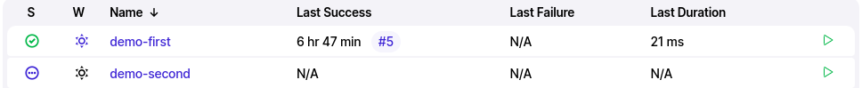
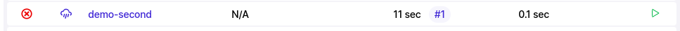

On the forty ninth day, I learned the following things about CI/CD Pipeline.

# Search Panel

- Before working on the search plan, let's do the initial steps first.

- First enable jenkins and start it by writing the following commands.

      sudo systemctl enable jenkins

      service jenkins start

- Open the browser and type `http://jenkins.local:8080/` and it will open the jenkins dashboard for you.

- Create another job and write `echo "Hello World"` in it.

- The jobs will be shown to you like this.

 
    

- As you can see in the above picture that there are two jobs and one of them has a tick sign and other one has three dots.

- The tick sign represents that the job is built and the three dots represent that this job is not built yet.

- The sun shows the stability sign. Both of the jobs are stable now.

- Last success shows the last time, the job was succeeded. The **#5** number shows the 5 builds that were successfully done.

- Last failure shows the last time, the job was failed.

- Let's configure the job and write an unexisted command in the Execute shell.

- After writing an unexisted command, if you build it, it will show you the error message like this.

 
    

- Here you can see in the picture that the cloud bursted because the command is wrong.

- The last failure was 11 seconds ago and that first build failed.

## Search panel

- Now let's write demo in the search bar and click on it. It will show you all the jobs that start with the word demo. You can choose any job from them.

- If you want to choose a specific name, you can also write it there.

- If you want to search a specific build in a job then you can write let's say *demo-first 1* or *demo-first 4*

- If you want to get the console of the job then you can write like this *demo-first 1 console*. It will give you the first build result of a particular job.

## Naming convention

- You should follow the proper naming convention to give the jobs a name like:

    1. testproject-build
    2. testproject-deploy
    3. testproject-production

## Manage jenkins

- Click on the manage jenkins option and it will lead you to another page.

- Read the description of each option and take overview about it.

- Go to the system configure message and in the system message type **Hello World** and apply it.

- If you want to easily access the configuration then write configure in the search bar and it will lead you there.

- You will see an option after the configure message section and that is **# of executors**. the number of executors will show that how many jobs you can run in a system. You can change its number.

## Install plugins

- Click on the manage jenkins option in the dashboard.

- Open the manage jenkins option in the system configuration option.

- In the plugin manager, you will get the updates, available plugins, installed plugins and the advanced tab through you which you can deploy your own plugin.

- Now install a plugin let's say a theme, you can go to the jenkins [website](https://www.jenkins.io/) and click on the plugins option.

- You will get into the search bar. Here write the word theme and it show you the bunch of themes to install.

- Go the manage jenkins, and click on the plugin manager. Enter the name of the plugin that you want in the available option. If the plugin is found then search it then select it and click on the install without restart button.

- After installing it, it will show you the success message.

- Check on the restart jenkins option and then login again.

- After login, open the manage jenkins option and click on the configure system option.

- If you scroll down, you will see three built-in themes. Click on any of them and apply them.

## Create user

- Go to the manage jenkins option and scroll down to click on the manage users under the security.

- Click on the create user option at the left side and it will ask you the username, password, confirm password and the full name.

- Save it, logout and now enter the username and password of a new user.

## **Explaining it in a video**

Here you can get an explanation in a video. [49/60 Day of DevOps Challenge]()