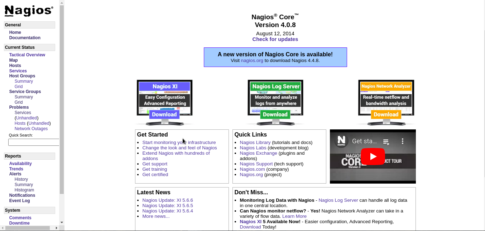

On the fifty third day, I learned the following things about Continuous Monitoring.

## Installation of Nagios

**Step 1**

- To start Nagios core installation you must have your EC2 instance up and run and have already configured. SSH access to the http.

- During the creation of AWS instance, auto-assign public-ip should be enabled.

- Give the security group a name that is *nagios*.

- Edit security group and allow all the traffic instead of allowing only HTTPS.

- Number of instance should only be one.

- Give the tag name as Nagios-server.

- Allow all the traffic anywhere for testing purpose.

- Create a key-pair by a name nagioskey and download it.

- Click on the launch install button and then click on the view instances.

- Click on the server option in AWS and copy the public IP address. Once the IP is copied, open the terminal and write `ssh ec2-user@<public-ip-address>`. It will give us an option to write YES or NO. Type yes and it will give you permission denied message.

- Go to the directory where the ansible key is present and use it in the machine by writing `ssh -i <file-name.pem> ec2-user@<public-ip-address>`.

- It will give another error like this **Permissions 0664 for 'ansiblekey.pem' are too open.**

- To counter this error, change the permission by writing `chmod 0400 ansiblekey.pem` and then again write `ssh -i <file-name.pem> ec2-user@<public-ip-address>`.

- You can exit it by writing **exit** and again run it by writing `ssh -i <file-name.pem> ec2-user@<public-ip-address>`.

**Step 2**

- Once the instance is created, write `sudo su` to go to the root user of the instance.

- `yum install httpd php` will install httpd and php packages.

- `yum install gcc glibc glibc-common` will install these libraries.

- `yum install gd gd-devel` will install development package.

**Step 3**

- Create account information, you need to setup a nagios user. Run the following commands.

    - `adduser -m nagios`
    - `passwd nagios`

- Now it will ask you the password. Give it any password.

- Now add a group by typing `groupadd nagioscmd`.

- Add users in a group by typing

    - `usermod -a -G nagioscmd nagios`
    - `usermod -a -G nagioscmd apache`

**Step 4**

- Create a downloads directory inside a home directory by writing `mkdir ~/Downloads` and go inside it by writing `cd ~/Downloads`.

- Download the source code tarballs of both nagios and the nagios plugins.

    - `wget http://prdownloads.sourceforge.net/sourceforge/nagios/nagios-4.0.8.tar.gz`
    - `wget http://nagios-plugins.org/download/nagios-plugins-2.0.3.tar.gz`

**Step 5**

- Compile and install nagios. Extract the nagios source code tarball.

    - `tar zxvf nagios-4.0.8.tar.gz`
    - `cd nagios-4.0.8`

- Run the configuration script with the name of the group which you have created in the above step.

    - `./configure --with-command-group=nagioscmd`

- Compile the nagios source code by typing `make all`.

- Install binaries, init script, sample config files and set permission on the external command directly. To compile init script type.

    - `make install`
    - `make install-init`
    - `make install-config`
    - `make install-commandmode`

**Step 6**

- Configure the web-interface by typing `make install-webconf`.

**Step 7**

- Create a nagiosadmin account for login into the nagios web-interface. Set password as well.

    - `htpasswd -c /usr/local/nagios/etc/htpasswd.users nagiosadmin`

- Asking for password. Set a new password by typing `service httpd restart`.

**Step 8**

- Compile and install the nagios plugins. Extract the nagios plugins. Source code tarball.

    - `cd ~/Downloads`
    - `tar zxvf nagios-plugins-2.0.3.tar.gz`
    - `cd nagios-plugins-2.0.3`

- Compile and install the plugins.

    - `./configure --with-nagios-user=nagios --with-nagios-group=nagios`
    - `make`
    - `make install`

**Step 9**

- Start nagios. Add nagios to the list of system services and have it automatically start when the system boots.

    - `chkconfig --add nagios`
    - `chkconfig nagios on`

**Step 10**

- Verify the sample nagios configuration files.

    - `/usr/local/nagios/bin/nagios -v /usr/local/nagios/etc/nagios.cfg`

- If there are not errors, start nagios.

    - `service nagios start`
    - `service httpd restart`

**Step 11**

- Copy public ip address of EC2 instance and paste it in google chrome in a given way.

    - **For example:** `12.1.1.1/nagios/` in the browser
    - Enter the username: nagiosadmin
    - Enter the password: 12345

- You will see the dashboard like this:

 
    

## **Explaining it in a video**

Here you can get an explanation in a video. [53/60 Day of DevOps Challenge](https://www.youtube.com/watch?v=U7O0w-iXg7c&list=PLptbpfKzsc3BtEki4tHQm5Xmpj8w1_JlM&index=50)