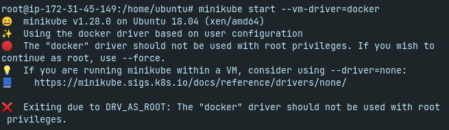
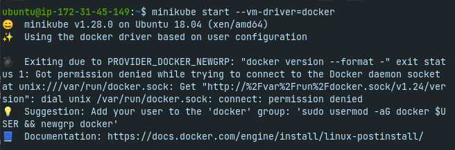
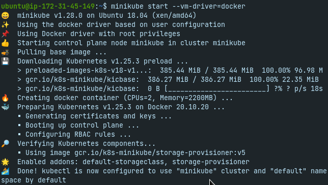

On the sixteeth day, I learned the following things about Helm.

## Helm Commands

- `helm repo` will interact with charts or YAML files repository that you can download according to your need.

- `helm repo list` will show you the list of repositories that are connected with helm.

- `helm repo add <repo-name> <URL>` will add the repo to the helm.

- `helm repo remove <repo-name>` will remove the repo from the helm.

- `helm search repo <chart-name>` will search the charts.

- `helm show <values | chart | readme | all> <chart-name>` will show the information of a chart before installation.

- `helm install <release-name> <chart-name>` will install a package for you.

- `helm install <release-name> <chart-name> --wait --timeout 10s` will wait for 10 seconds and then show you the result of installation.

- `helm create <chart-name>` will create a new chart with a given name.

## Helm Installation

- Before installing helm, you need to first of all install the minikube either in your local machine or in the remote server.

- The commands for installing the minikube increased when you install it on AWS server. I will show you all the commands.

- First open the AWS management console and create the t2 medium instance.

- Click on the launch instance. Give the tag name minikube and select an ubuntu image 18.04.

- Choose the t2.medium instance type that is not free but required. It won't charge you that much.

- Leave the details as it is like the number of instances. Create a security group and give it a name **minikube-sg** and allow all the traffic.

- Create a key pair and download to use it further and launch the instance.

- Once the instance is launched and running, click on it and copy the public address of it.

- Go to the directory where the key is present and use it in the machine by writing `ssh -i <file-name.pem> ubuntu@<public-ip-address>`. 

- If you type `ec2-user` as we have used before then it will give you this error: `ec2-user@<ip-address>: Permission denied (publickey).` Check out this [website](https://docs.aws.amazon.com/AWSEC2/latest/UserGuide/connection-prereqs.html) for setting different usernames.

- It will give another error like this **Permissions 0664 for 'key.pem' are too open.**

- To counter this error, change the permission by writing `chmod 0400 <file-name.pem>` and then again write `ssh -i <file-name.pem> ubuntu@<public-ip-address>`.

- Once the instance is created, write `sudo su` to go to the root user of the instance.

- First of all install the docker by writing `sudo apt update && apt -y install docker.io`

- Then install the kubectl by writing `curl -LO https://storage.googleapis.com/kubernetes-release/release/$(curl -s https://storage.googleapis.com/kubernetes-release/release/stable.txt)/bin/linux/amd64/kubectl && chmod +x ./kubectl && sudo mv ./kubectl /usr/local/bin/kubectl`

- Then install the minikube by writing `curl -Lo minikube https://storage.googleapis.com/minikube/releases/latest/minikube-linux-amd64 && chmod +x minikube && sudo mv minikube /usr/local/bin`

- Once the minikube is installed, start it by first writing `apt install conntrack`

- After that, type `minikube start --vm-driver=docker` and it will give you the following error.

 
    

- It is saying that docker should not be used with root privilege. To solve this problem, type `CTRL+D` to go out from root.

- After that, again type `minikube start --vm-driver=docker` and it will give you another following error.

 
    

- To solve this problem, type the following commands.

      sudo groupadd docker
      sudo usermod -aG docker $USER
      newgrp docker

- If it is still not working recovering then visit this [website](https://linuxhandbook.com/docker-permission-denied/#:~:text=deal%20with%20it.-,Fix%201%3A%20Run%20all%20the%20docker%20commands%20with%20sudo,the%20Docker%20daemon%20socket%27%20anymore.) that will show you more ways.

- Once the commands are executed successfully, you will get the following result.

 
    

- If you type `minikube status`, it will show you running status.

- Once the minikube is started, write `curl -fsSL -o get_helm.sh https://raw.githubusercontent.com/helm/helm/master/scripts/get-helm-3`

- After installation, write `chmod 700 get_helm.sh` to change the permission and then `./get_helm.sh` to run it.

- If you type `which helm`, it will show you the location `usr/local/bin/helm`

- Check the helm version by typing `helm version`

## Initial commands

- `helm repo add stable https://charts.helm.sh/stable` will create your first helm chart by the name of stable.

- Once the repo is added, type `helm repo list`. You will see that a new repo is added.

- If you want to remove the stable repo, type `helm repo remove stable`. If you type `helm repo list` again, it will show you nothing.

- Again install the `stable` chart and then type `helm search repo jenkins`. It will search the jenkins for you by the name `stable/jenkins`.

- `helm search repo tomcat` will search the tomcat for you by the name `stable/tomcat`.

- `helm search repo apache` will search the apache and bring out multiple charts.

- `helm show values stable/tomcat` will show you the values of tomcat.

- `helm show chart stable/tomcat` will show you the chart of tomcat.

- `helm show all stable/tomcat` will show you all the information of the tomcat chart.

- `sudo apt install tree` will install the tree package for you.

- `helm create helloworld` will create the helloworld chart for you and type `ls` to show the **helloworld** directory.

- Write `tree`. It will show you all the directories and subdirectories and files in them.

- To delete the chart, type `rm -rf helloworld`.

- Type `kubectl get all`. It will give you all the details of the pods, deployments, services etc.

- Type `helm install testjenkins stable/jenkins`. It will deploy your jenkins release.

- Type `helm install testtomcat stable/tomcat`. It will deploy your tomcat release.

- Type `kubectl get all` again and it will show you all the data like pods, deployments etc of the charts that you have created.

- `helm list` will show you the information of that release.

- `helm delete testjenkins` will uninstall the testjenkins release.

- You can also dry run the command. It means that the command won't be executed but it will show you the output that if that command is executed then the result will be like this.

- To execute the dry run command, type `helm install --dry-run testchart stable/tomcat`.

- If you type `kubectl get all`. It didn't installed the testchart, it just showed the output without executing the command.

- Now delete the testtomcat release by writing `helm delete testtomcat`.

- Again type `kubectl get all`. It will show you nothing.

- `helm list` will show you nothing because everything is uninstalled.

- `helm install --wait --timeout 20s testtomcat stable/tomcat` will wait for 20 seconds and then the release will be created.

- Type `kubectl get all` and it will show you the new chart that is created.

- Now if you type `helm list`. It will show you the version of it also.

- Install another release of tomcat with different version by typing `helm install testchart stable/tomcat --version <version>`.

- If you type `helm list`. It will show you two tomcat charts with different versions.

## Change the configuration during installation

- If you want to set parameters or change the configuration data during the installation then there are two ways. The first one is the `--set` and the second one is the `--values` or `-F`.

- `--set` specifies the command in the command line that needs to be executed during the installation.

- `--values` specifies a YAML file that contains a list of commands to be executed. It will work when you first install your chart.

- First delete all the releases by writing `helm delete <release-name>` and then write `helm list` to check whether the charts are present or not.

- Show the values of the chart before installation by writing `helm show values stable/tomcat`. If you scroll up, you will see that under the service there is a type load balancer that you need to change.

- Write `helm install <release-name> stable/tomcat --set service.type=NodePort` and now the service type load balancer is replaced with node port in the command line.

- `helm get <all | manifest | values> <release-name>` will show you the parameters that are changed after the chart installation.

- `helm list` will show you all the releases.

- `helm status <release-name>` will show you status of a particular release.

- `helm history <release-name>` will show you the history of the release.

- `helm install testchart stable/tomcat --version 0.4.0` will install the old version of release.

- `helm list` will show you the number of releases.

- `helm upgrade <release-name> <chart-name>` will upgrade the release with that chart. e.g. `helm upgrade testtomcat stable/tomcat`.

- `helm rollback <release-name>` will roll you back to a specific version.

## Some other commands

- Go to helmhub/artifacthub [website](https://artifacthub.io/) and there you will find many charts and search the mysql chart and download it using the following commands.

      helm repo add my-repo https://charts.bitnami.com/bitnami
      helm install my-release my-repo/mysql

- Once the MySQL chart is installed, type `helm list`. It will show you a new release by the name of my-release.

- You can delete the chart using the following command.

      helm delete my-release

- `helm history <release-name>` will show you the history of the release.

- Again install the mysql but the previous version with new name `helm install my-release2 my-repo/mysql --version <version>`.

- Type `helm list` to show you the charts with multiple releases.

- `helm pull <chart-name>` will download the tar file of a chart from a repository. Chart name is `stable/tomcat`.

- `helm pull --untar <chart-name>` will download the tar file of a chart from a repository and also untar it.

- Type `ls` to show the untar directory and get inside the untar directory to check the files in it.

- You can install the chart from the local chart archive, e.g. `helm install <release-name> tomcat-0.4.3.tgz`.

- You can install the release from an unpacked chart directory also, e.g. `helm install <release-name> untarred-directory-name`. Release name could be anything.

## **Explaining it in a video**

Here you can get an explanation in a video. [60/60 Day of DevOps Challenge](https://www.youtube.com/watch?v=tOGwqs1AC90&list=PLptbpfKzsc3BtEki4tHQm5Xmpj8w1_JlM&index=57)