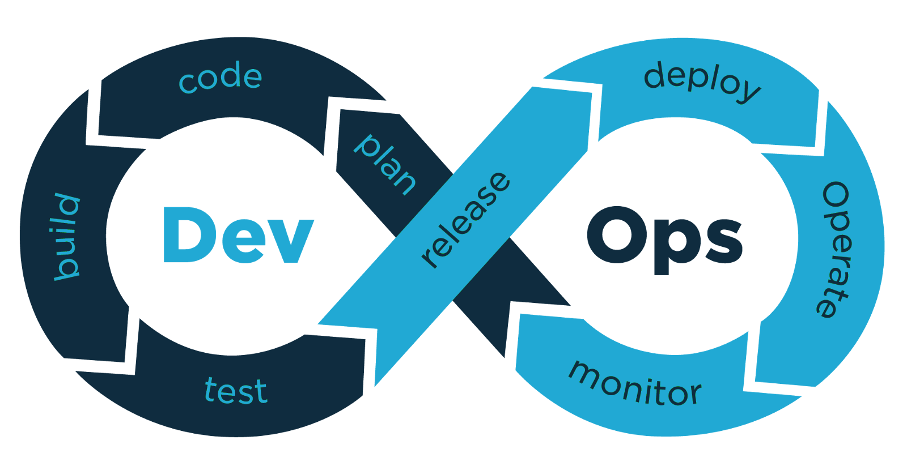

# 60-Days-Of-DevOps

 
    

This repository is used to document my journey of **60 Days of DevOps** challenge. The reason for this documentation is to help others understand the stuff that are required for *DevOps*.

This journey will not cover all things about "DevOps" but it will cover the areas that I feel will benefit my learning and understanding overall. I have created 60 videos for 60 days. So if you don't understand the documentation, you can watch the videos also.

Let's write the DevOps definition here and then start the journey day by day. I hope you will enjoy this. Happy Learning!

# What is DevOps?

The word DevOps is a combination of the terms development and operations, meant to represent a collaborative or shared approach to the tasks performed by a company's application development and IT operations teams.

 
    

It is an ability to deliver applications and services at high velocity: evolving and improving products at a faster pace than organizations using traditional software development and infrastructure management processes. This speed enables organizations to better serve their customers and compete more effectively in the market.

## How DevOps Works?

Under a DevOps model, development and operations teams are no longer “siloed.” Sometimes, these two teams are merged into a single team where the engineers work across the entire application lifecycle, from development and test to deployment to operations, and develop a range of skills not limited to a single function.

In some DevOps models, quality assurance and security teams may also become more tightly integrated with development and operations and throughout the application lifecycle. When security is the focus of everyone on a DevOps team, this is sometimes referred to as DevSecOps.

# Progress

## **Learn Git and GitHub**
- 📚 [**Day No. 1:** Git Init, Commit, Stash, etc](Days/day1.md)
- 📚 [**Day No. 2:** Git Branch & Checkout](Days/day2.md)
- 📚 [**Day No. 3:** GitHub Origin and Upstream repositories](Days/day3.md)

## **Learn Networking**
- 🌐 [**Day No. 4:** Computer Networking, Protocols, IP Address, etc](Days/day4.md)
- 🌐 [**Day No. 5:** Identify an Application, Ways of Communication, etc](Days/day5.md)
- 🌐 [**Day No. 6:** Network Topologies & OSI Model](Days/day6.md)
- 🌐 [**Day No. 7:** TCP/IP Model, Networking Architecture, etc](Days/day7.md)
- 🌐 [**Day No. 8:** HTTPS Methods, DNS, etc](Days/day8.md)
- 🌐 [**Day No. 9:** Transport Layer, TCP & UDP, etc](Days/day9.md)
- 🌐 [**Day No. 10:** Network Layer, Internet protocols, etc](Days/day10.md)
- 🌐 [**Day No. 11:** Data Link Layer, Firewall, etc](Days/day11.md)

## **Learn Linux**
- 🐧 [**Day No. 12:** Copying, Moving, & Removing Files, etc](Days/day12.md)
- 🐧 [**Day No. 13:** Root Privilege, Searching Files & Finding Text in it, etc](Days/day13.md)
- 🐧 [**Day No. 14:** Aliases, Sorting of Data, etc](Days/day14.md)

## **Learn YAML**
- ⌨️ [**Day No. 15:** Markup Language, Objects, etc](Days/day15.md)
- ⌨️ [**Day No. 16:** YAML Syntax, Listing, Data Types, etc](Days/day16.md)
- ⌨️ [**Day No. 17:** Sequence, Map, Pairs, etc](Days/day17.md)

## **Learn Docker**
- 🏗️ [**Day No. 18:** Virtual Machine, Container, & Docker](Days/day18.md)
- 🏗️ [**Day No. 19:** Pull Image, Start & Stop Containers, etc](Days/day19.md)
- 🏗️ [**Day No. 20:** Docker Build & Docker Engine](Days/day20.md)

## **Learn Kubernetes**
- ☸ [**Day No. 21:** Monolithic vs Microservices, Kubernetes & its history, etc](Days/day21.md)
- ☸ [**Day No. 22:** Kubernetes Architecture, Master & Worker Nodes, etc](Days/day22.md)
- ☸ [**Day No. 23:** Minikube Installation, & Executing YAML Files, etc](Days/day23.md)
- ☸ [**Day No. 24:** Labels & Selectors and their Usage](Days/day24.md)
- ☸ [**Day No. 25:** Deployment & Rollback](Days/day25.md)
- ☸ [**Day No. 26:** Kubernetes Networking](Days/day26.md)
- ☸ [**Day No. 27:** Jobs, Init containers & Pod Lifecycle](Days/day27.md)

## **Learn Kubernetes Tools**

- 🔧 [**Day No. 28:** Learn Datree](Days/day28.md)
- 🔧 [**Day No. 29:** Learn Lens](Days/day29.md)
- 🔧 [**Day No. 30:** Learn Monokle](Days/day30.md)
- 🔧 [**Day No. 31:** Learn Kubescape](Days/day31.md)
- 🔧 [**Day No. 32:** Learn GitHub Actions](Days/day32.md)

## **Learn Prometheus**

- 📈 [**Day No. 33:** Learn Prometheus](Days/day33.md)
- 📈 [**Day No. 34:** Prometheus installation & Node Exporter](Days/day34.md)

## **Learn Terraform**

- 🤖 [**Day No. 35:** DevOps Tasks Before & After Automation, Terrafrom Intro](Days/day35.md)
- 🤖 [**Day No. 36:** Terraform Configurations, Write Multiple Blocks, etc](Days/day36.md)
- 🤖 [**Day No. 37:** Set a Default Value, Multiple Variables, etc](Days/day37.md)
- 🤖 [**Day No. 38:** Map Variable, TFVARS files, etc](Days/day38.md)
- 🤖 [**Day No. 39:** Terraform Core & Terraform Plugin](Days/day39.md)
- 🤖 [**Day No. 40:** Terraform .tfstate file & destroy Command](Days/day40.md)
- 🤖 [**Day No. 41:** Terraform Refresh, Output, etc](Days/day41.md)

## **Learn Ansible**

- 📜 [**Day No. 42:** System Administrator Problems & Solutions, etc](Days/day42.md)
- 📜 [**Day No. 43:** Create a User & Make Changes in Nodes](Days/day43.md)
- 📜 [**Day No. 44:** Ad-hoc Commands, Ansible Modules, etc](Days/day44.md)
- 📜 [**Day No. 45:** Learn Ansible Playbook](Days/day45.md)
- 📜 [**Day No. 46:** Ansible Conditions and Roles](Days/day46.md)

## **Learn CI/CD Pipeline**

- 🔄 [**Day No. 47:** Before & After CI/CD Pipeline, & Jenkins Intro](Days/day47.md)
- 🔄 [**Day No. 48:** Jenkins Installation && First Hello-World, etc](Days/day48.md)
- 🔄 [**Day No. 49:** Search Panel, Installation of Plugins](Days/day49.md)
- 🔄 [**Day No. 50:** Jenkins Role Base Access Control](Days/day50.md)
- 🔄 [**Day No. 51:** Jenkins Upstream and Downstream](Days/day51.md)

## **Learn Continuous Monitoring**

- 📈 [**Day No. 52:** Continuous Monitoring & Nagios Intro](Days/day52.md)
- 📈 [**Day No. 53:** Installation of Nagios & Dashboard Overview](Days/day53.md)

## **Learn Cloud Computing**

- ☁️ [**Day No. 54:** Before & After Cloud, Services in Cloud, etc](Days/day54.md)
- ☁️ [**Day No. 55:** Elastic Compute Cloud, General Purpose & Compute Optimized Instances](Days/day55.md)
- ☁️ [**Day No. 56:** Memory & Storage Optimized Instances](Days/day56.md)
- ☁️ [**Day No. 57:** Accelerated Computing, High Memory Instances, etc](Days/day57.md)
- ☁️ [**Day No. 58:** AWS Demo](Days/day58.md)

## **Learn Helm**

- 🔨 [**Day No. 59:** Intro of Helm and Its Usage](Days/day59.md)
- 🔨 [**Day No. 60:** Learn Helm Commands](Days/day60.md)

## **Author Info**

- YouTube -> [iBilalKayy](https://www.youtube.com/channel/UCBLTfRg0Rgm4FtXkvql7DRQ)
- Hashnode -> [ibilalkayy](https://ibilalkayy.hashnode.dev/)
- LinkedIn -> [ibilalkayy](https://www.linkedin.com/in/ibilalkayy/)
- Twitter -> [ibilalkayy](https://twitter.com/ibilalkayy)

[Back to Top](#60-Days-Of-DevOps)